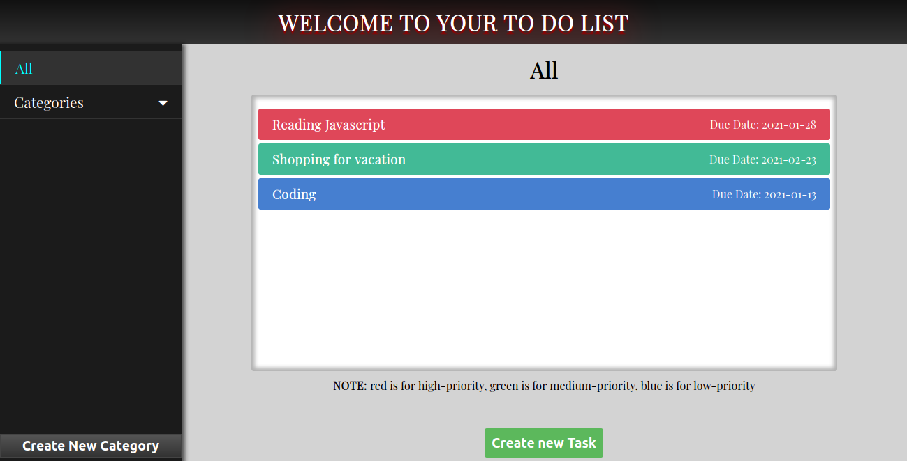
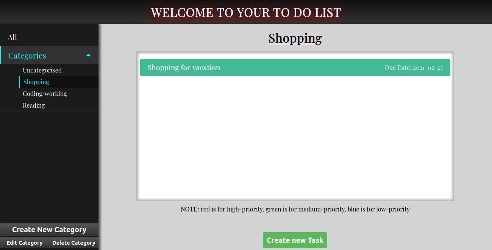
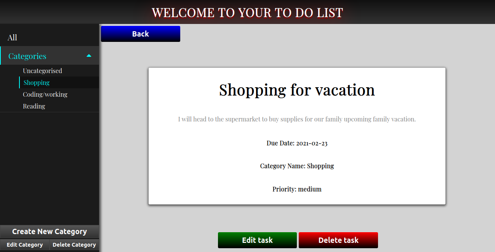

# To-Do-List

The Todo List demonstrates the Authors' understanding of dynamically creating objects using JavaScript fundamentals, that include either Factories, Constructors or Classes, by implementing the following requirements of the project:

1. View and edit all categories.

1. View and edit all todo/tasks in each categories 

1. Click a single todo/task to see/edit its details

1. Create and Delete a category.

1. Create and Delete a task.

## Screenshots

## LIVE DEMO
[Live Demo Link](https://raw.githack.com/RNtaate/To-Do-List/feature_list/dist/index.html)

## Built With

- HTML5 and CSS3
- JavaScript(including ECMAScript 6 concepts)
- Node Package Manager(npm) 
- Webpack
- Babel

## Getting Started

To get a local copy up and running follow these simple example steps.

### Prerequisites

- Install Node Package Manager(npm).
- Code Editor of your choice.

### Setup

- To clone the repo to your local repository. Follow this steps
- <code> git clone git@github.com:RNtaate/To-Do-List.git </code>
- <code> cd to-do-list</code>
- Run `npm install` to get all the necessary dependencies.
- Open `index.html` in your preferred browser.

## Author

:bust_in_silhouette: **Rumbidzayi Mudziviri**
- Github: [@Rumbie-Mudzie7](https://github.com/Rumbie-Mudzie7)
- Twitter: [@RumbidzayiMudz3](https://twitter.com/RumbidzayiMudz3)
- Linkedin: [rumbidzayimudziviri](https://www.linkedin.com/in/rumbidzayi-mudziviri)
- rumbiemudzie@gmail.com

:bust_in_silhouette: **Roy Ntaate**
- Github: [@RNtaate](https://github.com/RNtaate)
- Twitter: [@RNtaate](https://twitter.com/RNtaate)
- Linkedin: [roy-ntaate](https://linkedin.com/in/roy-ntaate) 

## :handshake: Contributing

There are two ways of contributing to this project:
1.  If you see something wrong or not working, please check [the issue tracker section](https://github.com/RNtaate/To-Do-List/issues ), if that problem you met is not in already opened issues then open the issue by clicking on `new issue` button.
2.  If you have a solution to that, and you are willing to work on it, follow the below steps to contribute:
    1.  Fork this repository
    1.  Clone it on your local computer by running `git clone git@github.com:RNtaate/To-Do-List.git` __Replace *RNtaate* with the username you use on github__
    1.  Open the cloned repository which appears as a folder on your local computer with your favorite code editor
    1.  Create a separate branch off the *master branch*,
    1.  Write your codes which fix the issue you found
    1.  Commit and push the branch you created
    1.  Raise a pull request, comparing your new created branch with our original master branch [here](https://github.com/RNtaate/To-Do-List)

## Show your support

Give a :star:️ if you like this project!

## Acknowledgments
[Microverse](https://www.microverse.org)
[Odin Project](https://www.theodinproject.com/courses/javascript/lessons/todo-list)

## :memo: License

MIT
